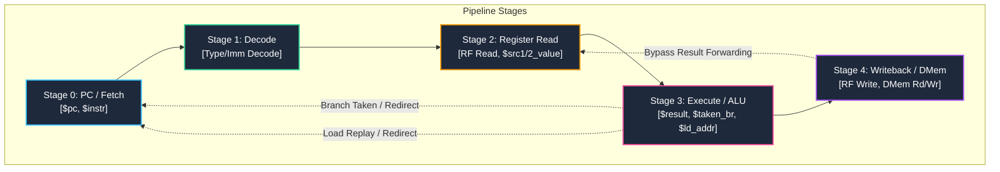

# 🚀 RISC-V RV32I Pipelined Processor Core

A high-performance, 5-stage pipelined RISC-V (RV32I) processor core designed using Transaction-Level Verilog (TL-Verilog) and verified in the Makerchip IDE. Developed as a comprehensive hardware engineering project, this core implements instruction fetching, instruction decoding, immediate value extraction, arithmetic-logic unit (ALU) execution, data memory interfacing, and robust hazard mitigation strategies including register bypassing and load-use hazard replays.

---

## 🗺️ Project Navigation

* **Processor Core Source**: [final_cpu.tlv](file:///Users/avannithakur/Desktop/RISC-V-MYTH-Workshop/day-05-pipelined-risc-v/final_cpu.tlv)
* **Development Progression**: [development-variants/](file:///Users/avannithakur/Desktop/RISC-V-MYTH-Workshop/day-05-pipelined-risc-v/development-variants/)
* **Project Showcase**: [project-showcase/README.md](file:///Users/avannithakur/Desktop/RISC-V-MYTH-Workshop/project-showcase/README.md)
* **Core Documentation**: [docs/](file:///Users/avannithakur/Desktop/RISC-V-MYTH-Workshop/docs/)
  * **Theory Records**: [Day 1](file:///Users/avannithakur/Desktop/RISC-V-MYTH-Workshop/docs/theory/day-01-risc-v-fundamentals.md) | [Day 2](file:///Users/avannithakur/Desktop/RISC-V-MYTH-Workshop/docs/theory/day-02-isa-and-encoding.md) | [Day 3](file:///Users/avannithakur/Desktop/RISC-V-MYTH-Workshop/docs/theory/day-03-tl-verilog.md) | [Day 4](file:///Users/avannithakur/Desktop/RISC-V-MYTH-Workshop/docs/theory/day-04-risc-v-cpu.md) | [Day 5](file:///Users/avannithakur/Desktop/RISC-V-MYTH-Workshop/docs/theory/day-05-pipelining.md)
  * **Lab Records**: [Day 1](file:///Users/avannithakur/Desktop/RISC-V-MYTH-Workshop/docs/labs/day-01-labs.md) | [Day 2](file:///Users/avannithakur/Desktop/RISC-V-MYTH-Workshop/docs/labs/day-02-labs.md) | [Day 3](file:///Users/avannithakur/Desktop/RISC-V-MYTH-Workshop/docs/labs/day-03-labs.md) | [Day 4](file:///Users/avannithakur/Desktop/RISC-V-MYTH-Workshop/docs/labs/day-04-labs.md) | [Day 5](file:///Users/avannithakur/Desktop/RISC-V-MYTH-Workshop/docs/labs/day-05-labs.md)

---

## 🛠️ Processor Specifications & Microarchitecture

The design maps the complete RISC-V RV32I Base Integer Instruction Set across a 5-stage instruction pipeline.



* **ISA Architecture**: RV32I (32-bit Integer Instruction Set) including arithmetic, logical, conditional branch, load/store memory operations, and jumps.
* **Pipeline Structure**: 5 Stages (`Fetch`, `Decode`, `Register Read`, `Execute`, `Writeback`) annotated with `@0` to `@4` timing stages.
* **Hazard Resolution**:
  * **Data Hazards**: Register file bypass path dynamically routes results from the execution/writeback stages back to the inputs of dependent instructions.
  * **Control Hazards**: Taken branches invalidate sequentially fetched instructions during execution and redirect the PC.
  * **Load-Use Hazards**: A load-replay path forces dependent instructions to stall and refetch if they attempt to read load data before it is available from memory.
* **Automatic Clock Gating**: The TL-Verilog compiler automatically synthesizes clock-gating cells based on transaction validity (`$valid`), significantly reducing active switching power.

---

## ⚡ SystemVerilog vs. TL-Verilog Comparison

Developing hardware in Transaction-Level Verilog (TL-Verilog) shifts focus from low-level register instantiation and clock-to-clock pipeline staging to high-level logic pipelines.

| Aspect | SystemVerilog | TL-Verilog |
|---|---|---|
| **Code Verbosity** | Sprawling; requires manual staging buffers and flip-flops. | Compact; ~3.5x fewer lines of code. |
| **Pipeline Modeling** | Manually declared registers (`q <= d`) per stage. | High-level timing stages (`@1`, `@2`) with automatic staging. |
| **Retiming/Refactoring** | High risk; changing pipeline depth requires rewriting declarations. | Safe and trivial; compiler handles signal alignment when stages change. |
| **Clock Gating** | Manually inserted gating cells or complex tool inferences. | Synthesized automatically based on pipeline signal validity (`$valid`). |
| **Data Hazard Bypassing** | Large multiplexer trees that are easy to misconnect. | Declarative staging relationships (`>>1$signal`, `>>2$signal`). |

---

## 📆 Day-by-Day Implementation Walkthrough

### 📦 Day 1 — Software-Hardware Interface & Toolchain

The project began by exploring how high-level software compiles down to target architecture instructions and interacts with system hardware through the Application Binary Interface (ABI).

#### Key Concepts Learned
* **RISC-V ISA**: Categorization of instructions (Base Integer RV32I/RV64I, Multiply/Divide RV64M, Floating-Point Extensions RV64F/RV64D).
* **Compiler-Assembler-Linker Flow**: How a C source file is converted to object code, how the linker maps symbols, and how object dumps reveal binary assembly instructions.
* **Spike Emulator & Debugger**: Running and stepping through instructions interactively, examining program counter (PC) values, and querying register contents.
* **Data Widths & Endianness**: Distinction between bytes, halfwords, words, and doublewords. Understood RISC-V's implementation of little-endian memory layout.

#### Visual Evidence of Lab Work

##### 1. Assembly Compilation & Optimization Analysis
Compiling `sum1ton.c` using the cross-compiler toolchain and examining assembly output under `-O1` optimization (showing 15 instructions in main):


Compiling under `-Ofast` optimization showing loop optimizations and instruction count reduction (reducing to 12 instructions):


##### 2. Simulation & Interactive Debugging
Simulating the binary using the Spike RISC-V ISA simulator in interactive debug mode. Executed instructions step-by-step and examined registers (`a0`, `a2`) to verify programmatic loops:


##### 3. Integer Representation & ABI Subroutine Routing
Verifying signed and unsigned values by simulating an unsigned overflow program (`unsignedhighest.c`) on Spike, yielding `18446744073709551615`:


Developing a custom C program calling an assembly subroutine (`load.S`) to verify parameter passing conventions over registers `a0` and `a1`:


Running the integrated assembly subroutine on Spike and checking results:


Analyzing the final object dump to inspect instructions and hex representations:


---

### 🏛️ Day 2 — RISC-V Instruction Set Architecture (ISA) & Encoding

Before writing RTL, the encoding scheme of the RV32I architecture was analyzed to plan the decoder logic.

#### Key Concepts Learned
* **Instruction Formats**: Analyzed how R, I, S, B, U, and J instructions arrange their immediate fields and register selectors.
* **Fields Structure**: Studied `opcode`, `funct3`, `funct7`, `rs1`, `rs2`, and `rd`.
* **Immediate Reconstruction**: Formulated immediate logic to align scattered bits into a unified, sign-extended 32-bit immediate payload depending on the decoded instruction format.

```text
Instruction Formats:
R-Type: | funct7 | rs2 | rs1 | funct3 | rd | opcode |
I-Type: | immediate[11:0] | rs1 | funct3 | rd | opcode |
S-Type: | imm[11:5] | rs2 | rs1 | funct3 | imm[4:0] | opcode |
B-Type: | imm[12|10:5] | rs2 | rs1 | funct3 | imm[4:1|11] | opcode |
U-Type: | immediate[31:12] | rd | opcode |
J-Type: | imm[20|10:1|11|19:12] | rd | opcode |
```

---

### 🎛️ Day 3 — Digital Logic, TL-Verilog, & Makerchip Platform

Day 3 established the hardware design foundation using the Makerchip online IDE and TL-Verilog. 

#### Key Concepts Learned
* **Timing-Abstract Hardware Description**: Signal pipelines, where stages are labeled (`@1`, `@2`) and stage propagation is handled by the compiler.
* **State & Recurrence**: Implementing sequential state (`$cnt = $reset ? 0 : >>1$cnt + 1;`) to form counters and recurrence loops.
* **Validity (`$valid`)**: Gating transactions so calculations are only executed when signals contain valid data.
* **Memory Architectures**: Designing 1-entry and 8-entry memory arrays to read and write stateful data index-by-index.

#### Visual Evidence of Lab Work

##### 1. Combinational Logic Labs
Exploring the Makerchip editor, compiler logs, visualizer, and waveform panels:


Implementing a vector-width adder for the Pythagorean Theorem calculation ($a^2 + b^2 = c^2$):


Implementing a 2-to-1 vector multiplexer:


Building a combinational calculator supporting addition, subtraction, multiplication, and division:


##### 2. Sequential Logic & State Labs
Modeling a Fibonacci recurrence sequence ($f(n) = f(n-1) + f(n-2)$) with reset states:


Designing an 8-bit free-running counter:


Integrating state into the calculator to design a sequential accumulator (storing and updating the calculated result):


##### 3. Pipelining & Validity Labs
Distributing the calculator logic over a multi-stage pipeline:


Applying a validity signal (`$valid`) to control when the pipelined calculator processes transactions:


Designing a 2-cycle calculator executing operations on alternate cycles:


Gating the 2-cycle calculator with validity logic:


##### 4. Memory Integration Labs
Adding a single-value memory element to calculate and recall values:


Expanding memory to an 8-entry memory array using a 3-bit index to write and retrieve values:


---

### 🧠 Day 4 — Core RISC-V Datapath Design

On Day 4, the single-cycle RISC-V CPU datapath was constructed.

#### Key Concepts Learned
* **Program Counter**: Drives instruction memory addresses and handles sequential steps (`PC + 4`).
* **Instruction Decoder**: Classifies opcodes, funct fields, register numbers, and reconstructs 32-bit immediates.
* **Arithmetic Logic Unit**: Performs arithmetic and comparison operations.
* **Register File**: A 2-read, 1-write storage array mapping the 32 architectural registers. Included logic to ensure register `x0` remains hard-wired to zero.
* **Branch Unit**: Evaluates target addresses and conditional codes (equality, comparisons) to update the program counter.

#### Visual Evidence of Lab Work

##### 1. Instruction Fetch & Decoders
Designing the Program Counter to step through addresses sequential to instruction fetch:


Instantiating the instruction memory block containing the test binary program:


Connecting the PC address to the instruction memory to output instruction codes (`$instr`):


Decoding instructions into types (I, R, S, B, J, U):


Generating sign-extended instruction-type-dependent immediates:


##### 2. Fields Decoder, ALU, & Register File
Extracting registers indices (`rs1`, `rs2`, `rd`) and funct fields under valid conditions:


Implementing the ALU to compute results for register and immediate instructions (ADD/ADDI):


Integrating a register file to perform dual register reads:


Connecting ALU results to the register file writeback port, protecting `x0`:


##### 3. Branching & Verification
Determining if a branch is taken based on source register comparisons:


Selecting the branch target in the PC multiplexer when a branch instruction evaluates to taken:


Verifying datapath functionality against a test program (register `x10` reaches `45`):


---

### ⛓️ Day 5 — Pipelined Microarchitecture & Hazard Mitigation

Day 5 focused on transforming the single-cycle datapath into a 5-stage pipelined processor while maintaining architectural correctness.

#### Key Concepts Learned
* **Pipeline Timing Stages**: Staging signals from Fetch `@0`, Decode `@1`, Register Read `@2`, Execute `@3` to Writeback `@4`.
* **Data Hazards**: Solved using forwarding bypass multiplexers. If an instruction depends on a register written by an instruction that has not completed writeback, the operand value is bypassed directly from the execution or writeback stage.
* **Control Hazards**: Handled by invalidating the validity (`$valid`) of the instructions in the shadow of a taken branch, redirecting the fetch stage to the branch target.
* **Load-Use Hazards**: Since memory reads take longer, dependent instructions must stall. The load-replay mechanism invalidates instructions in the load shadow, redirects the PC to refetch them, and bypasses the load result when it becomes available.

#### Visual Evidence of Lab Work

##### 1. Pipeline Staging
Staging CPU logic across 5 pipeline stages and checking waveforms:


##### 2. Branch Resolution in Pipeline
Configuring branch taken redirects over the pipeline, invalidating instructions in the branch shadow:


##### 3. Register Forwarding (Bypassing)
Resolving data hazards by routing executing results back to the register inputs of dependent instructions:


##### 4. Memory Interfaces
Enabling data memory load/store operations:


Handling load-use hazards through a load replay mechanism (forces a refetch loop):


Integrating the dual-ported Data Memory block:


##### 5. Functional Program Verification
Executing the complete program verifying load and store execution (writing result to address 16, loading back into register `x17`):


##### 6. Jumps Integration
Adding Jump and Link (JAL/JALR) target calculation and execution redirection:


---

## 🔬 Functional Verification & Testbench

The correctness of the pipelined processor was verified using a testbench program compiled into instruction memory. 

### Test Program Logic
The program iterates through a loop to sum integers from 1 to 9 ($1 + 2 + \dots + 9 = 45$). The result is accumulated in register `x14` (`a4`). Upon loop termination, the final sum is written to register `x10` (`a0`), stored in data memory at byte address 16, and loaded back into register `x17` (`a7`).

The assembly code mapped in instruction memory is:
```assembly
# Regs: r10 (a0) = 0, r12 (a2) = 10, r13 (a3) = intermediate sum, r14 (a4) = accumulated sum
ADD r10, r0, r0             # a0 = 0
ADD r14, r10, r0            # a4 = 0
ADDI r12, r10, 10           # a2 = 10
ADD r13, r10, r0            # a3 = 0
# Loop:
ADD r14, r13, r14           # a4 = a3 + a4
ADDI r13, r13, 1            # a3 = a3 + 1
BLT r13, r12, -12           # If a3 < a2, branch back to Loop
ADD r10, r14, r0            # a0 = a4 (sum = 45)
# Verification store and load
SW r0, r10, 16              # Store sum to memory address 16
LW r17, r0, 16              # Load sum from memory address 16 into r17
```

### Makerchip Testbench Assertion
The testbench evaluates the value of register `x17` (stored as `xreg[17]` in the CPU hierarchy) at stage `@4`. The simulator checks:
```tl-verilog
*passed = |cpu/xreg[17]>>5$value == (1+2+3+4+5+6+7+8+9);
```
When `xreg[17]` reaches `45`, the testbench asserts success, printing a `passed` message in the simulation logs and halting.

---

## 📈 Key Technical Insights & Takeaways

1. **Transaction-Level Verilog Productivity**: Designing at the transaction level dramatically reduces boilerplate code, automatically aligns pipelines, and avoids manual staging errors.
2. **Pipeline Hazard Mechanics**: Implementing forwarding paths and load replays highlighted the balance between hardware execution latency, pipeline stalls, and CPU throughput (IPC).
3. **Optimizations & Instruction Density**: Day 1 compiler optimization analysis showed that compiler flags significantly influence loops, conditional branches, and total instruction counts, affecting program execution time on custom silicon.
4. **End-to-End Verification Strategy**: Staged functional checkpoints (e.g. verifying sequential PC, decode correctness, ALU execution, and register writes independently) simplified debugging before running the complete test program.
